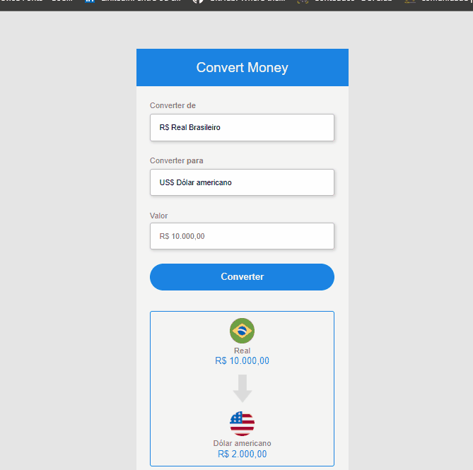

# Conversor de moedas

<h2>Converta do Real para Dolar, Euro e Bitcoin!</h2>
 

> Moedas atualizadas em tempo real!

 

Foi usado uma API para a atualização a cada 30s dos valores das moedas. 

### Ajustes e melhorias

O projeto ainda está em desenvolvimento e as próximas atualizações serão voltadas nas seguintes tarefas:

- [x] Html
- [x] Css
- [x] JS
- [x] API de atualização das moedas em tempo real
- [x] responsividade

## 🤝 Colaborador

<table>
  <tr>
    <td align="center">
      <a href="#">
         
        
          <b>Adriano Santos</b>
        
      </a>
    </td>
  </tr>
</table>
